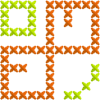

 Renraku   
=======

This is the code quality framework for [Pharo](http://pharo.org). The main goal of Renraku is to provide a concept of quality as a first class entity that can be used by a different tools to improve programming experience.

At the moment Renraku is used by:

 * [QualityAssistant](https://github.com/Uko/QualityAssistant)
 * [ViDI](https://github.com/Uko/Vidi) _(uses older version)_
